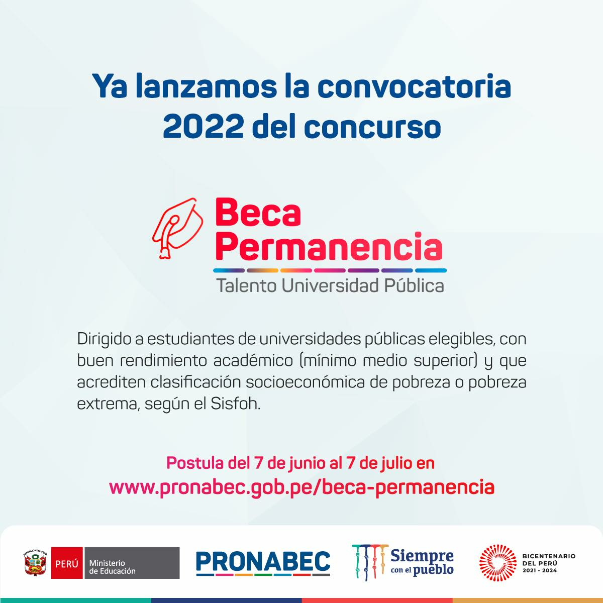

PRONABEC (Programa Nacional de Becas y Crédito Educativo) es un programa del Ministerio de Educación del Perú el cual te ofrece la oportunidad de optar por diferentes becas para que puedas culminar tus estudios universitarios, dependiendo del nivel en el que te encuentres, es decir, podrás realizar estudios de **pregrado**, **postgrado** o incluso en **carreras técnicas**.

Entre las becas que ofrece el PRONABEC se encuentran:

* Beca Permanencia
* Beca Continuidad
* Beca 18
* Beca Generación del Bicentenario
* Beca Perú
* Beca Alianza del Pacifico

De todas estas becas que ofrece el PRONABEC comentaremos sobre las dos primeras, ya que ambas becas tanto la _Beca Permanencia_ como _Beca Continuidad_ son para el nivel de Pregrado.

## Beca Permanencia

Esta beca esta dirigida a estudiantes de universidades públicas que tengan buen desempeño académico y estén cursando el nivel de Pregrado.

### Beneficios

Entre los beneficios que ofrece la beca se encuentran:

* Alimentación
* Útiles de escritorio
* Movilidad local

Esta beca te ofrece mensualmente el monto aproximado de S/.920.00 soles el cual se deposita en una cuenta que te apertura PRONABEC luego de haber obtenido la beca. Aparte esta beca ofrece un monto adicional para la adquisición de una Laptop, aunque esto depende de cada convocatoria (el monto que se ofreció para la convocatoria 2021 fue de S/.2159.00).

### Duración de la Beca

Esta beca dura hasta la fecha en la cual el becario debería culminar su plan de estudios.

Es decir si el beneficiario se hace acreedor de la beca estando en 3er ciclo entonces la beca solo cubriría desde el 3er ciclo hasta el 10mo ciclo (en el caso de Física), si por algún motivo el becario se retrasa en los cursos y no termina de acuerdo a su plan de estudios, el siguiente ciclo posterior al 10mo no es subvencionado.

### Requisitos para postular

Los requisitos que se tienen para poder postular a la beca son los siguientes (teniendo en consideración la convocatoria de 2021):

* Tener nacionalidad peruana.
* Ser estudiante de universidad pública elegible.
* Poseer un buen rendimiento académico.
* Acreditar pobreza o pobreza extrema según el Sistema de Focalización de Hogares (Sisfoh) del Ministerio de Desarrollo e Inclusión Social.

### Registro del proceso de postulación

Postulación 2022

1. El [6 de junio](https://www.facebook.com/photo/?fbid=388337150000090&set=a.250435240456949) del año 2022 PRONABEC lanzó la Beca Permanencia:

    

## Beca Continuidad

La beca continuidad es un concurso dirigido a estudiantes de educación superior (tanto de universidades privadas como públicas) de buen rendimiento académico, que pertenecen a los hogares más vulnerables del país

### Beneficios

Los beneficios que ofrece la beca varían dependiendo de si el becario esta en una universidad pública o una privada:

* Para estudiantes en instituciones privadas: matrícula y pensión de estudios.
* Para estudiantes en instituciones públicas: manutención (alimentación, movilidad local y útiles de escritorio).

La manutención que ofrece la beca es la misma que Beca Permanencia, es decir el monto de 920 soles mensuales.

### Duración de la Beca

La beca financia los estudios comprendidos desde la adjudicación hasta por diez meses calendarios, de acuerdo a la malla curricular o plan de estudios. No incluye el financiamiento en el periodo vacacional.

### Requisitos para postular

Los requisitos que se tienen para poder postular a la beca son los siguientes (teniendo en consideración la convocatoria de 2022):

1. Nacionalidad peruana.
2. Acreditar condición de vulnerabilidad económica, de acuerdo al siguiente detalle:
   * **Pobreza o pobreza extrema**, la cual es consultada en línea a través del Sistema de Focalización de Hogares (Sisfoh) del Midis; o
   * **Ser receptor del Bono Yanapay** o ser hijo de un receptor de dicho bono (mayor detalle leer Artículo 11 bases del concurso).
3. Contar con matricula.
